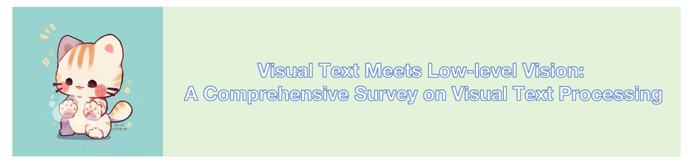

# Survey-of-Visual-Text-Processing
The official project of paper "Delving into Text Features: A Comprehensive Review on Visual Text Processing"

This repository contains a paper collection of recent works for visual text processing tasks.

## 📖 Table of Contents 👀
- [Text Image Super-resolution](#text-image-Super-resolution)
- [Document Image Dewarping](#Document-Image-Dewarping)
- [Text Image Denosing](#Text-Image-Denosing)
- [Scene Text Removal](#Scene-Text-Removal)
- [Scene Text Editing](#Scene-Text-Editing)
- [Scene Text Generation](#Scene-Text-Generation)
##

### Text Image Super-resolution
+ Boosting Optical Character Recognition: A Super-Resolution Approach (**2015 arxiv**) [paper](https://arxiv.org/pdf/1506.02211.pdf)
+ Photo-Realistic Single Image Super-Resolution Using a Generative Adversarial Network (**2017 CVPR**) [paper](https://openaccess.thecvf.com/content_cvpr_2017/html/Ledig_Photo-Realistic_Single_Image_CVPR_2017_paper.html)
+ TextSR: Content-Aware Text Super-Resolution Guided by Recognition (**2019 arxiv**) [paper](https://arxiv.org/pdf/1909.07113.pdf) [code](https://github.com/xieenze/TextSR)
+ Selective Super-Resolution for Scene Text Images (**2019 ICDAR**) [paper](https://ieeexplore.ieee.org/abstract/document/8977974)
+ Text-Attentional Conditional Generative Adversarial Network for Super-Resolution of Text Images (**2019 ICME**) [paper](https://ieeexplore.ieee.org/abstract/document/8784962)
+ Collaborative Deep Learning for Super-Resolving Blurry Text Images (**2020 TCI**) [paper](https://ieeexplore.ieee.org/abstract/document/9040515)
+ PlugNet: Degradation Aware Scene Text Recognition Supervised by a Pluggable Super-Resolution Unit (**2020 ECCV**) [paper](https://link.springer.com/chapter/10.1007/978-3-030-58555-6_10)
+ Scene Text Image Super-Resolution in the Wild (**2020 ECCV**) [paper](https://link.springer.com/chapter/10.1007/978-3-030-58607-2_38) [code](https://github.com/WenjiaWang0312/TextZoom)
+ Scene Text Telescope: Text-Focused Scene Image Super-Resolution (**2021 CVPR**) [paper](https://openaccess.thecvf.com/content/CVPR2021/papers/Chen_Scene_Text_Telescope_Text-Focused_Scene_Image_Super-Resolution_CVPR_2021_paper.pdf)
+ Scene Text Image Super-Resolution via Parallelly Contextual Attention Network (**2021 CVPR**) [paper](https://dl.acm.org/doi/abs/10.1145/3474085.3475469)
+ Text Prior Guided Scene Text Image Super-Resolution (**2021 TIP**) [paper](https://ieeexplore.ieee.org/abstract/document/10042236) [code](https://github.com/mjq11302010044/TPGSR)
+ A text attention network for spatial deformation robust scene text image super-resolution  (**2022 CVPR**) [paper](https://openaccess.thecvf.com/content/CVPR2022/papers/Ma_A_Text_Attention_Network_for_Spatial_Deformation_Robust_Scene_Text_CVPR_2022_paper.pdf) [code](https://github. com/mjq11302010044/TATT)
+ C3-STISR: Scene Text Image Super-resolution with Triple Clues (**2022 IJCAI**) [paper]
+ Text gestalt: Stroke-aware scene text image super-resolution (**2022 AAAI**) [paper](https://ojs.aaai.org/index.php/AAAI/article/download/19904/19663) [code](https://github.com/FudanVI/FudanOCR/tree/main/text-gestalt)
+ A Benchmark for Chinese-English Scene Text Image Super-Resolution (**2023 ICCV**) [paper](https://openaccess.thecvf.com/content/ICCV2023/html/Ma_A_Benchmark_for_Chinese-English_Scene_Text_Image_Super-Resolution_ICCV_2023_paper.html) [code](https://github.com/mjq11302010044/Real-CE)
+ Text Image Super-Resolution Guided by Text Structure and Embedding Priors (**2023 ACM MM**) [paper](https://dl.acm.org/doi/abs/10.1145/3595924)
+ Improving Scene Text Image Super-Resolution via Dual Prior Modulation Network (**2023 AAAI**) [paper](https://arxiv.org/pdf/2302.10414.pdf) [code](https://github.com/jdfxzzy/DPMN)
+ Learning Generative Structure Prior for Blind Text Image Super-Resolution (**2023 CVPR**) [paper](https://openaccess.thecvf.com/content/CVPR2023/html/Li_Learning_Generative_Structure_Prior_for_Blind_Text_Image_Super-Resolution_CVPR_2023_paper.html) [code](https://github.com/csxmli2016/MARCONet)

### Document Image Dewarping
+ A Fast Page Outline Detection and Dewarping Method Based on Iterative Cut and Adaptive Coordinate Transform (**2019 ICDARW**) [paper](https://ieeexplore.ieee.org/abstract/document/8892891)
+ DocUNet: Document Image Unwarping via a Stacked U-Net （**2018 CVPR**）[paper](https://openaccess.thecvf.com/content_cvpr_2018/papers/Ma_DocUNet_Document_Image_CVPR_2018_paper.pdf)
+ DewarpNet: Single-Image Document Unwarping With Stacked 3D and 2D Regression Networks (**2019 ICCV**) [[paper](https://openaccess.thecvf.com/content_ICCV_2019/papers/Das_DewarpNet_Single-Image_Document_Unwarping_With_Stacked_3D_and_2D_Regression_ICCV_2019_paper.pdf) [code](https://www.cs.stonybrook.edu/%E2%88%BCcvl/dewarpnet.html)
+ Document rectification and illumination correction using a patch-based CNN (**2019 TOG**) [paper](https://dl.acm.org/doi/abs/10.1145/3355089.3356563)
+ Dewarping Document Image by Displacement Flow Estimation with Fully Convolutional Network (**2020 IAPR**) [paper](https://arxiv.org/pdf/2104.06815)
+ Geometric rectification of document images using adversarial gated unwarping network (**2020 PR**) [paper](https://www.sciencedirect.com/science/article/abs/pii/S0031320320303794)
+ DocScanner: Robust Document Image Rectification with Progressive Learning (**2021 arxiv**) [paper](https://arxiv.org/pdf/2110.14968.pdf)
+ End-to-End Piece-Wise Unwarping of Document Images (**2021 ICCV**) [paper](https://openaccess.thecvf.com/content/ICCV2021/papers/Das_End-to-End_Piece-Wise_Unwarping_of_Document_Images_ICCV_2021_paper.pdf)
+ Document Dewarping with Control Points (**2021 ICDAR**) [paper](https://link.springer.com/chapter/10.1007/978-3-030-86549-8_30) [paper](https://github.com/gwxie/Document-Dewarping-with-Control-Points)
+ DocTr: Document Image Transformer for Geometric Unwarping and Illumination Correction (**2021 ACM MM**) [paper](https://arxiv.org/pdf/2110.12942.pdf) [code](https://github.com/fh2019ustc/DocTr)
+ Revisiting Document Image Dewarping by Grid Regularization (**2022 CVPR**) [paper](https://openaccess.thecvf.com/content/CVPR2022/papers/Jiang_Revisiting_Document_Image_Dewarping_by_Grid_Regularization_CVPR_2022_paper.pdf)
+ Fourier Document Restoration for Robust Document Dewarping and Recognition ((**2022 CVPR**) [paper])[https://openaccess.thecvf.com/content/CVPR2022/html/Xue_Fourier_Document_Restoration_for_Robust_Document_Dewarping_and_Recognition_CVPR_2022_paper.html]
+ Learning an Isometric Surface Parameterization for Texture Unwrapping (**2022 ECCV**) [paper](https://link.springer.com/chapter/10.1007/978-3-031-19836-6_33) [code](https://github.com/cvlab-stonybrook/Iso-UVField)
+ Geometric Representation Learning for Document Image Rectification (**2022 ECCV**) [paper](https://link.springer.com/chapter/10.1007/978-3-031-19836-6_27)
+ Learning From Documents in the Wild to Improve Document Unwarping (**2022 SIGGRAPH**) [paper](https://dl.acm.org/doi/abs/10.1145/3528233.3530756) [code](https://github.com/cvlab-stonybrook/PaperEdge)
+ Marior: Margin Removal and Iterative Content Rectification for Document Dewarping in the Wild (**2023 ACM MM**) [paper](https://arxiv.org/pdf/2207.11515.pdf) [code](https://github.com/ZZZHANG-jx/Marior)
+ DocAligner: Annotating Real-world Photographic Document Images by Simply Taking Pictures (**2023 arxiv**) [paper](https://arxiv.org/pdf/2306.05749.pdf)
+ DocMAE: Document Image Rectification via Self-supervised Representation Learning (**2023 ICME***) [paper](https://arxiv.org/pdf/2304.10341.pdf)
+ Deep Unrestricted Document Image Rectification  (**2023 arxiv**) [paper](https://arxiv.org/pdf/2304.08796.pdf) [code](https://github.com/fh2019ustc/DocTr-Plus)
+ Layout-aware Single-image Document Flattening (**2023 TOG**) [paper](https://dl.acm.org/doi/abs/10.1145/3627818) [code](https://github.com/BunnySoCrazy/LA-DocFlatten)

  

### Text Image Denosing
+ [ControlNet on Text Effect](https://mp.weixin.qq.com/s/rvpU4XhToldoec_bABeXJw) (Jul., 2023)

+ [DS-Fusion: Artistic Typography via Discriminated and Stylized Diffusion](https://arxiv.org/abs/2303.09604) (ICCV2023)  
  
  
  
  

### Scene Text Removal
+ Image-to-Image Translation with Conditional Adversarial Networks (**2017 CVPR**)  [paper](https://openaccess.thecvf.com/content_cvpr_2017/papers/Isola_Image-To-Image_Translation_With_CVPR_2017_paper.pdf)
+ Scene text eraser (**2017 ICDAR**) [paper](https://arxiv.org/pdf/1705.02772.pdf)
+ Automatic Semantic Content Removal by Learning to Neglect (**2018 BMVC**) [paper](https://arxiv.org/pdf/1807.07696.pdf)
+ Ensnet: Ensconce text in the wild (**2019 AAAI**) [paper](https://ojs.aaai.org/index.php/AAAI/article/download/3859/3737) [code](https://github.com/HCIILAB/Scene-Text-Removal)
+ Mtrnet: A generic scene text eraser (**2019 ICDAR**) [paper](https://arxiv.org/pdf/1903.04092)
+ Erasenet: End-to-end text removal in the wild (**2020 TIP**) [paper](https://ieeexplore.ieee.org/abstract/document/9180003) [code](https://github.com/HCIILAB/SCUT-EnsText)
+ Mtrnet++: One-stage mask-based scene text eraser (**2020 CVIU**) [paper](https://arxiv.org/pdf/1912.07183.pdf)
+ Erasing scene text with weak supervision (**2020 WACV**) [paper](https://openaccess.thecvf.com/content_WACV_2020/papers/Zdenek_Erasing_Scene_Text_with_Weak_Supervision_WACV_2020_paper.pdf)
+ Stroke-Based Scene Text Erasing Using Synthetic Data for Training (**2021 TIP**) [paper](https://ieeexplore.ieee.org/abstract/document/9609970)
+ Text region conditional generative adversarial network for text concealment in the wild (**2021 TCSVT**) [paper](https://ieeexplore.ieee.org/abstract/document/9509541)
+ Two-Stage Seamless Text Erasing On Real-World Scene Images (**2021 ICIP**) [paper](https://ieeexplore.ieee.org/abstract/document/9506394)
+ Scene text removal via cascaded text stroke detection and erasing (**2022 CVM**) [paper](https://link.springer.com/content/pdf/10.1007/s41095-021-0242-8.pdf)
+ Self-supervised text erasing with controllable image synthesis (**2022 ACM MM**) [paper](https://arxiv.org/pdf/2204.12743.pdf)
+ Multi-branch network with ensemble learning for text removal in the wild (**2022 ACCV**) [paper](https://openaccess.thecvf.com/content/ACCV2022/papers/Hou_Multi-Branch_Network_with_Ensemble_Learning_for_Text_Removal_in_the_ACCV_2022_paper.pdf)
+ The Surprisingly Straightforward Scene Text Removal Method with Gated Attention and Region of Interest Generation: A Comprehensive Prominent Model Analysis (**2022 ECCV**) [paper](https://arxiv.org/pdf/2210.07489) [code](https://github.com/naver/garnet)
+ Don’t forget me: accurate background recovery for text removal via modeling local-global context (**2022 ECCV**) [paper](https://arxiv.org/pdf/2207.10273) [code](https://github.com/lcy0604/CTRNet.)
+ Psstrnet: progressive segmentation-guided scene text removal network (**2022 ICME**) [paper](https://arxiv.org/pdf/2306.07842)
+ Fetnet: Feature erasing and transferring network for scene text removal (**2023 PR**) [paper](https://arxiv.org/pdf/2306.09593)
+ Modeling stroke mask for end-to-end text erasing (**2023 WACV**) [paper](https://openaccess.thecvf.com/content/WACV2023/papers/Du_Modeling_Stroke_Mask_for_End-to-End_Text_Erasing_WACV_2023_paper.pdf)
+ Viteraser: Harnessing the power of vision transformers for scene text removal with segmim pretraining (**2023 arxiv**) [paper](https://arxiv.org/pdf/2306.12106) [code](https://github.com/shannanyinxiang/ViTEraser)
+ Progressive scene text erasing with self-supervision (**2023 CVIU**) [paper](https://arxiv.org/pdf/2207.11469.pdf)
+ What is the Real Need for Scene Text Removal? Exploring the Background Integrity and Erasure Exhaustivity Properties (**2023 TIP**) [paper](https://ieeexplore.ieee.org/abstract/document/10214243) [code](https://github.com/wangyuxin87/PERT)
+ Selective scene text removal (**2023 BMVC**) [paper](https://arxiv.org/pdf/2309.00410.pdf) [code](https://github.com/mitanihayato/Selective-Scene-Text-Removal)

   
 

### Scene Text Editing
+ Scene text magnifier (**2019 ICDAR**) [paper](https://arxiv.org/pdf/1907.00693.pdf)
+ Selective style transfer for text (**2019 ICDAR**) [paper][https://arxiv.org/pdf/1906.01466.pdf] [code](https://github.com/furkanbiten/SelectiveTextStyleTransfer)
+ Editing text in the wild (**2019 ACM MM**) [paper](https://arxiv.org/pdf/1908.03047.pdf) [code](https://github.com/youdao-ai/SRNet)
+ Swaptext: Image based texts transfer in scenes (**2020 CVPR**) [paper](https://openaccess.thecvf.com/content_CVPR_2020/papers/Yang_SwapText_Image_Based_Texts_Transfer_in_Scenes_CVPR_2020_paper.pdf)
+ Scene text transfer for cross-language (**2021 ICIG**) [paper](https://link.springer.com/chapter/10.1007/978-3-030-87355-4_46)
+ Mask-guided gan for robust text editing in the scene (**2021 Neurocomputing**) [paper](https://www.sciencedirect.com/science/article/abs/pii/S092523122100299X)
+ Stefann: scene text editor using font adaptive neural network (**2020 CVPR**) [paper](https://openaccess.thecvf.com/content_CVPR_2020/papers/Roy_STEFANN_Scene_Text_Editor_Using_Font_Adaptive_Neural_Network_CVPR_2020_paper.pdf)
+ Deep learning-based forgery attack on document images (**2021 TIP**) [paper](https://arxiv.org/pdf/2102.00653)
+ Strive: Scene text replacement in videos (**2021 ICCV**) [paper](https://openaccess.thecvf.com/content/ICCV2021/papers/G_STRIVE_Scene_Text_Replacement_in_Videos_ICCV_2021_paper.pdf)
+ RewriteNet: Reliable Scene Text Editing with Implicit Decomposition of Text Contents and Styles (**2022 CVPRW**) [paper](https://arxiv.org/pdf/2107.11041.pdf) [code](https://github.com/clovaai/rewritenet)
+ Fast: Font-agnostic scene text editing (**2023 arxiv**) [paper](https://arxiv.org/abs/2308.02905)
+ Letter Embedding Guidance Diffusion Model for Scene Text Editing (**2023 ICME**) [paper](http://ercdm.sdu.edu.cn/__local/1/D6/7E/7C1DDDEFCDC240906F00E254B02_354743F8_1C042B.pdf)
+ Exploring stroke-level modifications for scene text editing (**2023 AAAI**) [paper](https://ojs.aaai.org/index.php/AAAI/article/view/25305/25077) [code](https://github.com/qqqyd/MOSTEL) 
+ Textstylebrush: Transfer of text aesthetics from a single example (**2023 TPAMI**) [paper](https://arxiv.org/pdf/2106.08385.pdf)
+ Self-Supervised Cross-Language Scene Text Editing (**2023 ACM MM**) [paper](https://dl.acm.org/doi/abs/10.1145/3581783.3612174)
+ Scene style text editing (**2023 arxiv**) [paper](https://arxiv.org/pdf/2304.10097.pdf)
+ Improving Diffusion Models for Scene Text Editing with Dual Encoders (**2023 arxiv**) [paper](https://arxiv.org/pdf/2304.05568.pdf) [code](https://github.com/UCSB-NLP-Chang/DiffSTE)
+ Towards scene-text to scene-text translation (**2023 arxiv**) [paper](https://arxiv.org/pdf/2308.03024.pdf)
+ DiffUTE: Universal Text Editing Diffusion Model (**2023 NIPS**) [paper](https://arxiv.org/abs/2305.10825) [code](https://github.com/chenhaoxing/DiffUTE)
+ On manipulating scene text in the wild with diffusion models (**2024 WACV**) [paper](https://arxiv.org/pdf/2311.00734.pdf) 

### Scene Text Generation
+ Synthetic Data and Artificial Neural Networks for Natural Scene Text Recognition (**2014 arxiv**) [paper](https://arxiv.org/pdf/1406.2227.pdf)
+ Synthetic data for text localisation in natural images (**2016 CVPR**) [paper](https://openaccess.thecvf.com/content_cvpr_2016/papers/Gupta_Synthetic_Data_for_CVPR_2016_paper.pdf) [paper](https://openaccess.thecvf.com/content_cvpr_2016/papers/Gupta_Synthetic_Data_for_CVPR_2016_paper.pdf) [code](https://github.com/ankush-me/SynthText)
+ Text detection in traffic informatory signs using synthetic data (**2017 ICDAR**) [paper](https://ieeexplore.ieee.org/abstract/document/8270075)
+ Verisimilar image synthesis for accurate detection and recognition of texts in scenes (**2018 ECCV**) [paper](https://openaccess.thecvf.com/content_ECCV_2018/papers/Fangneng_Zhan_Verisimilar_Image_Synthesis_ECCV_2018_paper.pdf)  [code](https://github.com/GodOfSmallThings/Verisimilar-Image-Synthesis-for-Accurate-Detection-and-Recognition-of-Texts-in-Scenes)
+ Synthtiger: Synthetic text image generator towards better text recognition models (**2021 ICDAR**) [paper](https://link.springer.com/chapter/10.1007/978-3-030-86337-1_8) [code](https://github.com/clovaai/synthtiger)
+  

